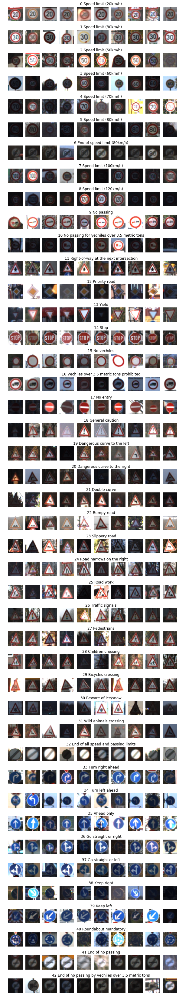
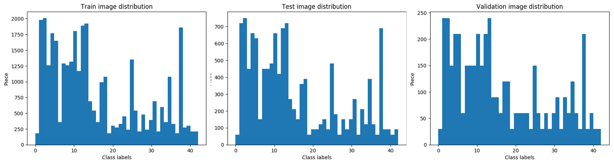
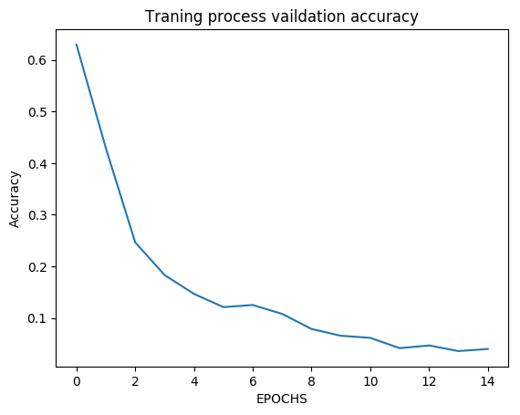
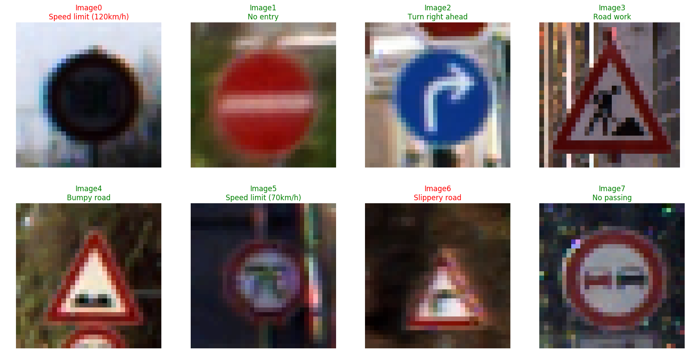

# **Traffic Sign Recognition** 

## Writeup

### You can use this file as a template for your writeup if you want to submit it as a markdown file, but feel free to use some other method and submit a pdf if you prefer.

---

**Build a Traffic Sign Recognition Project**

The goals / steps of this project are the following:
* Load the data set (see below for links to the project data set)
* Explore, summarize and visualize the data set
* Design, train and test a model architecture
* Use the model to make predictions on new images
* Analyze the softmax probabilities of the new images
* Summarize the results with a written report


[//]: # "Image References"

[image1]: ./examples/visualization.jpg "Visualization"
[image2]: ./examples/grayscale.jpg "Grayscaling"
[image3]: ./examples/random_noise.jpg "Random Noise"
[image4]: ./examples/placeholder.png "Traffic Sign 1"
[image5]: ./examples/placeholder.png "Traffic Sign 2"
[image6]: ./examples/placeholder.png "Traffic Sign 3"
[image7]: ./examples/placeholder.png "Traffic Sign 4"
[image8]: ./examples/placeholder.png "Traffic Sign 5"

## Rubric Points
### Here I will consider the [rubric points](https://review.udacity.com/#!/rubrics/481/view) individually and describe how I addressed each point in my implementation.  

---
### Writeup / README

#### 1. Provide a Writeup / README that includes all the rubric points and how you addressed each one. You can submit your writeup as markdown or pdf. You can use this template as a guide for writing the report. The submission includes the project code.

You're reading it! and here is a link to my [project code](https://github.com/udacity/CarND-Traffic-Sign-Classifier-Project/blob/master/Traffic_Sign_Classifier.ipynb)

### Data Set Summary & Exploration

#### 1. Provide a basic summary of the data set. In the code, the analysis should be done using python, numpy and/or pandas methods rather than hardcoding results manually.

I used the pandas library to calculate summary statistics of the traffic
signs data set:

* The size of training set is 34799
* The size of the validation set is 4410
* The size of test set is 12630
* The shape of a traffic sign image is (32, 32, 3)
* The number of unique classes/labels in the data set is 43

#### 2. Include an exploratory visualization of the dataset.

10 random image from each classes:



Data distribution between classes:




### Design and Test a Model Architecture

#### 1. Describe how you preprocessed the image data. What techniques were chosen and why did you choose these techniques? Consider including images showing the output of each preprocessing technique. Pre-processing refers to techniques such as converting to grayscale, normalization, etc. (OPTIONAL: As described in the "Stand Out Suggestions" part of the rubric, if you generated additional data for training, describe why you decided to generate additional data, how you generated the data, and provide example images of the additional data. Then describe the characteristics of the augmented training set like number of images in the set, number of images for each class, etc.)

Image preprocess steps:

* Create a copy to avoid overwrite original image.

* Resize image to 32x32. This is needed if I import image from another place.

* Convert image to grayscale to force neural network to focus on shapes.

* alpha_beta_auto_correction which extend the image pixel intensity range to [0, 255 ]

  ```python
  def alpha_beta_auto_correction(img):
      inputRange = np.amax(img) - np.amin(img)
      wantedrange = 255.0
      alpha = wantedrange / inputRange
      beta = - alpha * np.amin(img)
      return (img * alpha + beta).astype("uint8")
  ```

* Normalize pixel intensity to increase optimizer algorithm effectiveness.


At the training process, I generate augmented images to get more images, and to avoid the overfitting. For image modification I used ```imgaug``` library's randomly zooming, adding pan,  random brightness, and sharpening. At the training process I increase the batch size with 20% with the augmented images.

```python
def random_augment(image):
    if np.random.rand() < 0.5:   # 50% percent is true
        image = pan(image)
    if np.random.rand() < 0.5:   # 50% percent is true
        image = zoom(image)
    if np.random.rand() < 0.5:   # 50% percent is true
        image = img_random_brigthness(image)
    if np.random.rand() < 0.5:   # 50% percent is true
        image = sharpen(image)
    return image
```


#### 2. Describe what your final model architecture looks like including model type, layers, layer sizes, connectivity, etc.) Consider including a diagram and/or table describing the final model.

My final model consisted of the following layers:

| Layer         		|     Description	        					|
|:---------------------:|:---------------------------------------------:|
| Input         		| 32x32x1 Gray image							|
| Convolution 5x5     	| 1x1 stride, same padding, outputs 28x28x60 	|
| RELU					|												|
| Max pooling	      	| 2x2 stride,  outputs 14x14x60 				|
| Convolution 5x5		| 1x1 stride, same padding, outputs 10x10x16 	|
| RELU					|												|
| Max pooling	      	| 2x2 stride,  outputs 5x5x16					|
| Fully connected		| 400 neuron        							|
| Dropout layer			| Probability of keeping 50%					|
| Fully connected		| 120 neuron        							|
| RELU					|												|
| Dropout layer			| Probability of keeping 50%					|
| Fully connected		| 84 neuron	        							|
| RELU					|												|
| Dropout layer			| Probability of keeping 50%					|
| Fully connected		| 43 neuron (number of classes)					|
| Softmax				| 	        									|


#### 3. Describe how you trained your model. The discussion can include the type of optimizer, the batch size, number of epochs and any hyperparameters such as learning rate.

Hyperparameters for training:

```python
rate = 0.001
EPOCHS = 15
BATCH_SIZE = 128 # + 20 % augmentated images
```

To train the model, I used the Adam Optimizer. 


#### 4. Describe the approach taken for finding a solution and getting the validation set accuracy to be at least 0.93. Include in the discussion the results on the training, validation and test sets and where in the code these were calculated. Your approach may have been an iterative process, in which case, outline the steps you took to get to the final solution and why you chose those steps. Perhaps your solution involved an already well known implementation or architecture. In this case, discuss why you think the architecture is suitable for the current problem.

Results:

| Set name   | Accuracy |
| ---------- | -------- |
| Training   | 0.989    |
| Validation | 0.960    |
| Test       | 0.954    |


If an iterative approach was chosen:

* First, I used the MNIST classifier LeNet architecture.
* I increased the depth of the first two convolution layer to 60
* When the saw that the model overfits after 10 epochs, I added the first dropout layer after the first fully connected layer.




* What was the first architecture that was tried and why was it chosen?
* What were some problems with the initial architecture?
* How was the architecture adjusted and why was it adjusted? Typical adjustments could include choosing a different model architecture, adding or taking away layers (pooling, dropout, convolution, etc), using an activation function or changing the activation function. One common justification for adjusting an architecture would be due to overfitting or underfitting. A high accuracy on the training set but low accuracy on the validation set indicates over fitting; a low accuracy on both sets indicates under fitting.
* Which parameters were tuned? How were they adjusted and why?
* What are some of the important design choices and why were they chosen? For example, why might a convolution layer work well with this problem? How might a dropout layer help with creating a successful model?

If a well known architecture was chosen:
* What architecture was chosen?
* Why did you believe it would be relevant to the traffic sign application?
* How does the final model's accuracy on the training, validation and test set provide evidence that the model is working well?


### Test a Model on New Images

#### 1. Choose five German traffic signs found on the web and provide them in the report. For each image, discuss what quality or qualities might be difficult to classify.



Figure X. The green title means correct, and the red is bad predictions.

Image0 ("Speed limit (100km/h)") results:
| Class Id 			   | Probability    			     | &nbsp; &nbsp; &nbsp; &nbsp; &nbsp; &nbsp;&nbsp; &nbsp; &nbsp;&nbsp; &nbsp; &nbsp;&nbsp; &nbsp; &nbsp;&nbsp; &nbsp; &nbsp;Prediction&nbsp; &nbsp; &nbsp; &nbsp; &nbsp;&nbsp; &nbsp; &nbsp; &nbsp; &nbsp;&nbsp; &nbsp; &nbsp; &nbsp; &nbsp;&nbsp; &nbsp; &nbsp; &nbsp; &nbsp;	               |
|:---------------------:|:-------------------------------:|:-------------------------------:|
| 8	| 0.35514 | Speed limit (120km/h)	|
| 7	| 0.31918 | Speed limit (100km/h)	|
| 5	| 0.24206 | Speed limit (80km/h)	|
| 3	| 0.02007 | Speed limit (60km/h)	|
| 2	| 0.01741 | Speed limit (50km/h)	|

This image image light conditions is not the best. The the correct classification has the second largest probability.

Image1 ("No entry") results:

| Class Id 			   | Probability    			     | &nbsp; &nbsp; &nbsp; &nbsp; &nbsp; &nbsp;&nbsp; &nbsp; &nbsp;&nbsp; &nbsp; &nbsp;&nbsp; &nbsp; &nbsp;&nbsp; &nbsp; &nbsp;Prediction&nbsp; &nbsp; &nbsp; &nbsp; &nbsp;&nbsp; &nbsp; &nbsp; &nbsp; &nbsp;&nbsp; &nbsp; &nbsp; &nbsp; &nbsp;&nbsp; &nbsp; &nbsp; &nbsp; &nbsp;	               |
|:---------------------:|:-------------------------------:|:-------------------------------:|
| 17	| 1.00000 | No entry	|
| 14	| 0.00000 | Stop	|
| 33	| 0.00000 | Turn right ahead	|
| 34	| 0.00000 | Turn left ahead	|
| 36	| 0.00000 | Go straight or right	|

Image2 ("Turn right ahead") results:
| Class Id 			   | Probability    			     | &nbsp; &nbsp; &nbsp; &nbsp; &nbsp; &nbsp;&nbsp; &nbsp; &nbsp;&nbsp; &nbsp; &nbsp;&nbsp; &nbsp; &nbsp;&nbsp; &nbsp; &nbsp;Prediction&nbsp; &nbsp; &nbsp; &nbsp; &nbsp;&nbsp; &nbsp; &nbsp; &nbsp; &nbsp;&nbsp; &nbsp; &nbsp; &nbsp; &nbsp;&nbsp; &nbsp; &nbsp; &nbsp; &nbsp;	               |
|:---------------------:|:-------------------------------:|:-------------------------------:|
| 33	| 0.99999 | Turn right ahead	|
| 35	| 0.00001 | Ahead only	|
| 39	| 0.00000 | Keep left	|
| 10	| 0.00000 | No passing for vechiles over 3.5 metric tons	|
| 37	| 0.00000 | Go straight or left	|

Image3 ("Road work") results:
| Class Id 			   | Probability    			     | &nbsp; &nbsp; &nbsp; &nbsp; &nbsp; &nbsp;&nbsp; &nbsp; &nbsp;&nbsp; &nbsp; &nbsp;&nbsp; &nbsp; &nbsp;&nbsp; &nbsp; &nbsp;Prediction&nbsp; &nbsp; &nbsp; &nbsp; &nbsp;&nbsp; &nbsp; &nbsp; &nbsp; &nbsp;&nbsp; &nbsp; &nbsp; &nbsp; &nbsp;&nbsp; &nbsp; &nbsp; &nbsp; &nbsp;	               |
|:---------------------:|:-------------------------------:|:-------------------------------:|
| 25	| 0.99999 | Road work	|
| 22	| 0.00000 | Bumpy road	|
| 18	| 0.00000 | General caution	|
| 20	| 0.00000 | Dangerous curve to the right	|
| 29	| 0.00000 | Bicycles crossing	|

Image4 ("Bumpy road") results:
| Class Id 			   | Probability    			     | &nbsp; &nbsp; &nbsp; &nbsp; &nbsp; &nbsp;&nbsp; &nbsp; &nbsp;&nbsp; &nbsp; &nbsp;&nbsp; &nbsp; &nbsp;&nbsp; &nbsp; &nbsp;Prediction&nbsp; &nbsp; &nbsp; &nbsp; &nbsp;&nbsp; &nbsp; &nbsp; &nbsp; &nbsp;&nbsp; &nbsp; &nbsp; &nbsp; &nbsp;&nbsp; &nbsp; &nbsp; &nbsp; &nbsp;	               |
|:---------------------:|:-------------------------------:|:-------------------------------:|
| 22	| 0.98908 | Bumpy road	|
| 29	| 0.00985 | Bicycles crossing	|
| 25	| 0.00046 | Road work	|
| 31	| 0.00024 | Wild animals crossing	|
| 26	| 0.00020 | Traffic signals	|

Image5 ("Speed limit (70km/h)") results:
| Class Id 			   | Probability    			     | &nbsp; &nbsp; &nbsp; &nbsp; &nbsp; &nbsp;&nbsp; &nbsp; &nbsp;&nbsp; &nbsp; &nbsp;&nbsp; &nbsp; &nbsp;&nbsp; &nbsp; &nbsp;Prediction&nbsp; &nbsp; &nbsp; &nbsp; &nbsp;&nbsp; &nbsp; &nbsp; &nbsp; &nbsp;&nbsp; &nbsp; &nbsp; &nbsp; &nbsp;&nbsp; &nbsp; &nbsp; &nbsp; &nbsp;	               |
|:---------------------:|:-------------------------------:|:-------------------------------:|
| 4	| 0.93044 | Speed limit (70km/h)	|
| 1	| 0.04446 | Speed limit (30km/h)	|
| 0	| 0.01894 | Speed limit (20km/h)	|
| 2	| 0.00397 | Speed limit (50km/h)	|
| 8	| 0.00187 | Speed limit (120km/h)	|

Image6 ("Dangerous curve to the right") results:
| Class Id 			   | Probability    			     | &nbsp; &nbsp; &nbsp; &nbsp; &nbsp; &nbsp;&nbsp; &nbsp; &nbsp;&nbsp; &nbsp; &nbsp;&nbsp; &nbsp; &nbsp;&nbsp; &nbsp; &nbsp;Prediction&nbsp; &nbsp; &nbsp; &nbsp; &nbsp;&nbsp; &nbsp; &nbsp; &nbsp; &nbsp;&nbsp; &nbsp; &nbsp; &nbsp; &nbsp;&nbsp; &nbsp; &nbsp; &nbsp; &nbsp;	               |
|:---------------------:|:-------------------------------:|:-------------------------------:|
| 23	| 0.40319 | Slippery road	|
| 20	| 0.21979 | Dangerous curve to the right	|
| 29	| 0.07998 | Bicycles crossing	|
| 19	| 0.06856 | Dangerous curve to the left	|
| 28	| 0.05221 | Children crossing	|

The "Slippery road" and the "Dangerous curve to the right" signs has the same shape, and the drawing is similar on the sign. The correct prediction has the 2.  largest probability.


Image7 ("No passing") results:

| Class Id 			   | Probability    			     | &nbsp; &nbsp; &nbsp; &nbsp; &nbsp; &nbsp;&nbsp; &nbsp; &nbsp;&nbsp; &nbsp; &nbsp;&nbsp; &nbsp; &nbsp;&nbsp; &nbsp; &nbsp;Prediction&nbsp; &nbsp; &nbsp; &nbsp; &nbsp;&nbsp; &nbsp; &nbsp; &nbsp; &nbsp;&nbsp; &nbsp; &nbsp; &nbsp; &nbsp;&nbsp; &nbsp; &nbsp; &nbsp; &nbsp;	               |
|:---------------------:|:-------------------------------:|:-------------------------------:|
| 9	| 1.00000 | No passing	|
| 15	| 0.00000 | No vechiles	|
| 16	| 0.00000 | Vechiles over 3.5 metric tons prohibited	|
| 10	| 0.00000 | No passing for vechiles over 3.5 metric tons	|
| 41	| 0.00000 | End of no passing	|


#### 3. Describe how certain the model is when predicting on each of the five new images by looking at the softmax probabilities for each prediction. Provide the top 5 softmax probabilities for each image along with the sign type of each probability. (OPTIONAL: as described in the "Stand Out Suggestions" part of the rubric, visualizations can also be provided such as bar charts)

Here are five traffic signs that I found on the web:


*Figure X. Predictions for unseen images*


```
Accuracy: 83.333 %
```

Image0 ("Yield") results:
| Class Id 			   | Probability    			     | &nbsp; &nbsp; &nbsp; &nbsp; &nbsp; &nbsp;&nbsp; &nbsp; &nbsp;&nbsp; &nbsp; &nbsp;&nbsp; &nbsp; &nbsp;&nbsp; &nbsp; &nbsp;Prediction&nbsp; &nbsp; &nbsp; &nbsp; &nbsp;&nbsp; &nbsp; &nbsp; &nbsp; &nbsp;&nbsp; &nbsp; &nbsp; &nbsp; &nbsp;&nbsp; &nbsp; &nbsp; &nbsp; &nbsp;	               |
|:---------------------:|:-------------------------------:|:-------------------------------:|
| 13	| 0.93031 | Yield	|
| 35	| 0.02657 | Ahead only	|
| 2	| 0.00908 | Speed limit (50km/h)	|
| 38	| 0.00786 | Keep right	|
| 15	| 0.00625 | No vechiles	|

The **Image 0** is classified correctly as a yield sign with a 93 % certainty. This sign has a different shape as the others, and it was easy to recognize.


Image1 ("Road work") results:

| Class Id 			   | Probability    			     | &nbsp; &nbsp; &nbsp; &nbsp; &nbsp; &nbsp;&nbsp; &nbsp; &nbsp;&nbsp; &nbsp; &nbsp;&nbsp; &nbsp; &nbsp;&nbsp; &nbsp; &nbsp;Prediction&nbsp; &nbsp; &nbsp; &nbsp; &nbsp;&nbsp; &nbsp; &nbsp; &nbsp; &nbsp;&nbsp; &nbsp; &nbsp; &nbsp; &nbsp;&nbsp; &nbsp; &nbsp; &nbsp; &nbsp;	               |
|:---------------------:|:-------------------------------:|:-------------------------------:|
| 25	| 0.83549 | Road work	|
| 31	| 0.02969 | Wild animals crossing	|
| 22	| 0.02129 | Bumpy road	|
| 29	| 0.02073 | Bicycles crossing	|
| 21	| 0.01794 | Double curve	|

Image2 ("Speed limit (70km/h)") results:
| Class Id 			   | Probability    			     | &nbsp; &nbsp; &nbsp; &nbsp; &nbsp; &nbsp;&nbsp; &nbsp; &nbsp;&nbsp; &nbsp; &nbsp;&nbsp; &nbsp; &nbsp;&nbsp; &nbsp; &nbsp;Prediction&nbsp; &nbsp; &nbsp; &nbsp; &nbsp;&nbsp; &nbsp; &nbsp; &nbsp; &nbsp;&nbsp; &nbsp; &nbsp; &nbsp; &nbsp;&nbsp; &nbsp; &nbsp; &nbsp; &nbsp;	               |
|:---------------------:|:-------------------------------:|:-------------------------------:|
| 4	| 0.88218 | Speed limit (70km/h)	|
| 0	| 0.08749 | Speed limit (20km/h)	|
| 1	| 0.03030 | Speed limit (30km/h)	|
| 8	| 0.00001 | Speed limit (120km/h)	|
| 2	| 0.00001 | Speed limit (50km/h)	|

The **Image1** and the **Image2** also classified with a 83.5% and 88.2%, which are relatively big certainty.


Image3 ("Turn right ahead") results:

| Class Id 			   | Probability    			     | &nbsp; &nbsp; &nbsp; &nbsp; &nbsp; &nbsp;&nbsp; &nbsp; &nbsp;&nbsp; &nbsp; &nbsp;&nbsp; &nbsp; &nbsp;&nbsp; &nbsp; &nbsp;Prediction&nbsp; &nbsp; &nbsp; &nbsp; &nbsp;&nbsp; &nbsp; &nbsp; &nbsp; &nbsp;&nbsp; &nbsp; &nbsp; &nbsp; &nbsp;&nbsp; &nbsp; &nbsp; &nbsp; &nbsp;	               |
|:---------------------:|:-------------------------------:|:-------------------------------:|
| 33	| 0.57595 | Turn right ahead	|
| 11	| 0.12040 | Right-of-way at the next intersection	|
| 30	| 0.10013 | Beware of ice/snow	|
| 21	| 0.04970 | Double curve	|
| 40	| 0.04221 | Roundabout mandatory	|

The **Image3** is classified with 57.6% probability, which is 4.79x certain, than the second prediction.


Image4 ("Turn left ahead") results:

| Class Id 			   | Probability    			     | &nbsp; &nbsp; &nbsp; &nbsp; &nbsp; &nbsp;&nbsp; &nbsp; &nbsp;&nbsp; &nbsp; &nbsp;&nbsp; &nbsp; &nbsp;&nbsp; &nbsp; &nbsp;Prediction&nbsp; &nbsp; &nbsp; &nbsp; &nbsp;&nbsp; &nbsp; &nbsp; &nbsp; &nbsp;&nbsp; &nbsp; &nbsp; &nbsp; &nbsp;&nbsp; &nbsp; &nbsp; &nbsp; &nbsp;	               |
|:---------------------:|:-------------------------------:|:-------------------------------:|
| 34	| 0.27969 | Turn left ahead	|
| 38	| 0.24047 | Keep right	|
| 14	| 0.05932 | Stop	|
| 25	| 0.05847 | Road work	|
| 11	| 0.03833 | Right-of-way at the next intersection	|

The **Image4** has classified correctly, but only with a 28%. The second guess was the keep right sign, with 24%, which has similar background.


Image5 ("Stop") results:

| Class Id 			   | Probability    			     | &nbsp; &nbsp; &nbsp; &nbsp; &nbsp; &nbsp;&nbsp; &nbsp; &nbsp;&nbsp; &nbsp; &nbsp;&nbsp; &nbsp; &nbsp;&nbsp; &nbsp; &nbsp;Prediction&nbsp; &nbsp; &nbsp; &nbsp; &nbsp;&nbsp; &nbsp; &nbsp; &nbsp; &nbsp;&nbsp; &nbsp; &nbsp; &nbsp; &nbsp;&nbsp; &nbsp; &nbsp; &nbsp; &nbsp;	               |
|:---------------------:|:-------------------------------:|:-------------------------------:|
| 12	| 0.55334 | Priority road	|
| 40	| 0.24762 | Roundabout mandatory	|
| 1	| 0.07042 | Speed limit (30km/h)	|
| 14	| 0.03068 | Stop	|
| 6	| 0.01872 | End of speed limit (80km/h)	|

The **image 5** was wrongly classified, the stop sign has only the fourth largest probability.


### (Optional) Visualizing the Neural Network (See Step 4 of the Ipython notebook for more details)
#### 1. Discuss the visual output of your trained network's feature maps. What characteristics did the neural network use to make classifications?


