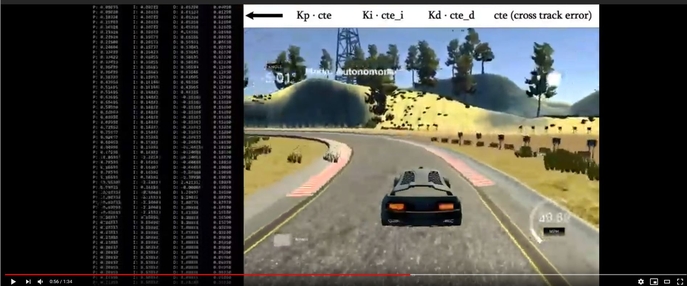
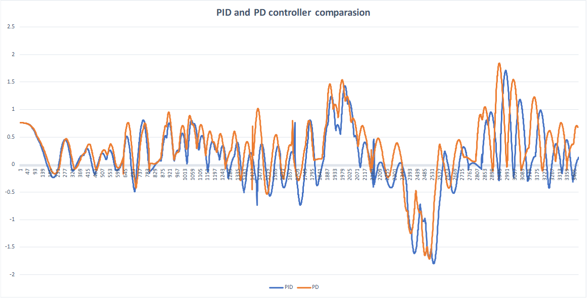

# Project-8-PID-Controller
Self-Driving Car Engineer Nanodegree Program


[](https://www.youtube.com/watch?v=3-9EjmQHY-8)

---

*Figure 1: Youtube video snapshot*

## Dependencies

* cmake >= 3.5
 * All OSes: [click here for installation instructions](https://cmake.org/install/)
* make >= 4.1(mac, linux), 3.81(Windows)
  * Linux: make is installed by default on most Linux distros
  * Mac: [install Xcode command line tools to get make](https://developer.apple.com/xcode/features/)
  * Windows: [Click here for installation instructions](http://gnuwin32.sourceforge.net/packages/make.htm)
* gcc/g++ >= 5.4
  * Linux: gcc / g++ is installed by default on most Linux distros
  * Mac: same deal as make - [install Xcode command line tools]((https://developer.apple.com/xcode/features/)
  * Windows: recommend using [MinGW](http://www.mingw.org/)
* [uWebSockets](https://github.com/uWebSockets/uWebSockets)
  
  * Run either `./install-mac.sh` or `./install-ubuntu.sh`.
  * If you install from source, checkout to commit `e94b6e1`, i.e.
    ```
    git clone https://github.com/uWebSockets/uWebSockets 
    cd uWebSockets
    git checkout e94b6e1
    ```
    Some function signatures have changed in v0.14.x. See [this PR](https://github.com/udacity/CarND-MPC-Project/pull/3) for more details.
* Simulator. You can download these from the [project intro page](https://github.com/udacity/self-driving-car-sim/releases) in the classroom.

Fellow students have put together a guide to Windows set-up for the project [here](https://s3-us-west-1.amazonaws.com/udacity-selfdrivingcar/files/Kidnapped_Vehicle_Windows_Setup.pdf) if the environment you have set up for the Sensor Fusion projects does not work for this project. There's also an experimental patch for windows in this [PR](https://github.com/udacity/CarND-PID-Control-Project/pull/3).

## Basic Build Instructions

1. Clone this repo.
2. Make a build directory: `mkdir build && cd build`
3. Compile: `cmake .. && make`
4. Run it: `./pid`. 

Tips for setting up your environment can be found [here](https://classroom.udacity.com/nanodegrees/nd013/parts/40f38239-66b6-46ec-ae68-03afd8a601c8/modules/0949fca6-b379-42af-a919-ee50aa304e6a/lessons/f758c44c-5e40-4e01-93b5-1a82aa4e044f/concepts/23d376c7-0195-4276-bdf0-e02f1f3c665d)


## Hyperparameters

Formula:

```u_t = Kp * error + Ki * error_i * dt + Kd * error_d / dt```
*Kp - proportional term,* 
*Ki - integral term,*
*Kd - derivative term*
*error_i - integral of the error*
*error_d - derivative of the error.*
*u_t - actuation, which is saturated with the actuator limits.*

### Conclusions:

**Kp** is important in the bends. If Kp is too small,  the car slides off in the bend. If Kp is too big, the controller oscillates, because actuation will be too big for small errors.

**Ki** is essential to minimize the error to zero. Ki is capable of eliminating biases. If Ki is too small, the error doesn't converge to 0. If Ki is too big, oscillation will occur.

**Kd** is vital to reduce the controller oscillation.


## Hyperparameter tuning

I manually tuned the hyperparameters which steps are described in [Thomas Braun Embedded Robotics p. 71. "4.2.4 PID Parameter tuning" sections](http://citeseerx.ist.psu.edu/viewdoc/download?doi=10.1.1.474.8129&rep=rep1&type=pdf).

My debug message for debugging looked like this:

``` P: 0.83296      I: 0.22356      D: -0.05652     0.35370
P: 0.96940      I: 0.26452      D: -0.23393     0.34810
P: 0.91841      I: 0.25389      D: -0.17230     0.34380
P: 0.95193      I: 0.26736      D: -0.21929     0.33860
P: 0.99357      I: 0.28442      D: -0.27798     0.33240
P: 1.03104      I: 0.30166      D: -0.33269     0.32540
P: 1.07899      I: 0.32372      D: -0.40271     0.31750
P: 1.12863      I: 0.34833      D: -0.47696     0.30880
P: 3.30839      I: 1.09158      D: -3.39998     0.28900
P: -1.38068     I: -0.51956     D: 2.90024      0.25350
```

Where 

```C++
P = Kp  * error / u_t; 

I = Ki * error_i / u_t;

D = Kd * error / u_t;
```

The last column is the ```CTE```. 

With this debug message, I could determine which PID term is the most dominant.




*Figure 2: Comparing PID and PD controller results*

```
PID_RMSE = 0.563876707
PD_RMSE  = 0.617450845
```

